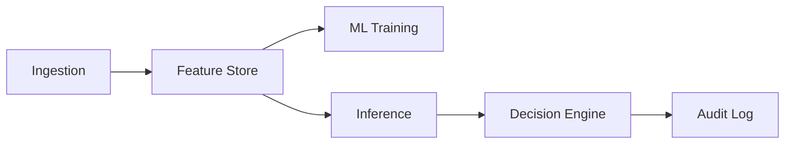

# Data Governance Policy

> How data flows, who can access it, and how it's protected.

## Data Classification

| Level | Description | Examples |
|-------|-------------|----------|
| **Public** | Freely shareable | Documentation |
| **Internal** | Company-only | Aggregated metrics |
| **Confidential** | Need-to-know | Feature data |
| **Restricted** | Strict access | PII, model decisions |

---

## Data Flow

---

## Access Controls

| Data Type | Access Level | Approval Required |
|-----------|--------------|-------------------|
| Raw events | Platform team | No |
| Features | ML + Platform | No |
| Model artifacts | ML team | Yes for prod |
| Predictions | Services | No |
| Audit logs | Platform only | Yes |

---

## Retention Policy

| Data Type | Retention | Reason |
|-----------|-----------|--------|
| Raw events | 30 days | Storage cost |
| Features | 90 days | Training windows |
| Predictions | 1 year | Audit requirements |
| Audit logs | 7 years | Compliance |

---

## Data Lineage

Every prediction must trace to:
1. Input features (snapshot ID)
2. Model version (hash)
3. Feature store version
4. Timestamp

---

## GDPR Compliance

- Right to access: `/v1/profile/{id}/explain`
- Right to erasure: `/v1/profile/{id}` DELETE
- Right to portability: Export endpoint planned
- No profiling without consent: Opt-in design

---

## Owner

**Mohit Ranjan** (Platform)

Last reviewed: 2026-01-16
