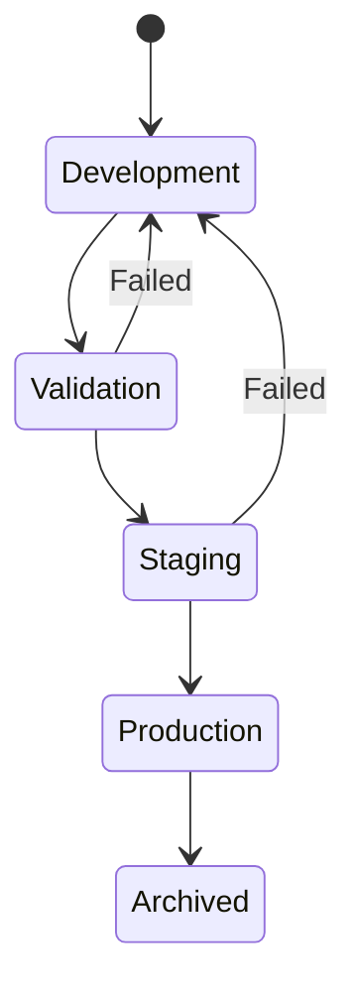

# Model Governance Policy

> How models are developed, validated, and deployed.

## Model Lifecycle

---

## Approval Gates

| Stage | Approvers | Criteria |
|-------|-----------|----------|
| Development → Validation | ML Lead | Tests pass |
| Validation → Staging | ML Lead + Platform | Metrics met |
| Staging → Production | ML + Platform + Services | All sign-off |

---

## Model Registry Requirements

Every production model must have:

| Field | Required | Example |
|-------|----------|---------|
| Name | ✅ | `inflow-baseline` |
| Version | ✅ | `v1.2.3` |
| Hash | ✅ | `sha256:abc123...` |
| Training date | ✅ | `2026-01-15` |
| Training data version | ✅ | `features-v3` |
| Metrics | ✅ | `f1=0.87, auc=0.92` |
| Owner | ✅ | `richa@inflow.ai` |

---

## Model Metrics Thresholds

| Metric | Minimum | Blocking |
|--------|---------|----------|
| F1 Score | 0.80 | Yes |
| AUC-ROC | 0.85 | Yes |
| Latency P99 | 100ms | Yes |
| Memory | 2GB | No |

---

## Model Explainability

All models must provide:
- SHAP values for feature importance
- Prediction confidence scores
- Explanation endpoint

---

## Bias Monitoring

Checked before promotion:
- Demographic parity
- Equal opportunity
- Calibration across segments

---

## Rollback Policy

| Trigger | Action |
|---------|--------|
| Accuracy drop > 5% | Alert + investigate |
| Accuracy drop > 10% | Auto-rollback |
| Error rate spike | Immediate rollback |

---

## Owner

**Richa** (ML)  
**Mohit Ranjan** (Platform)

Last reviewed: 2026-01-16
