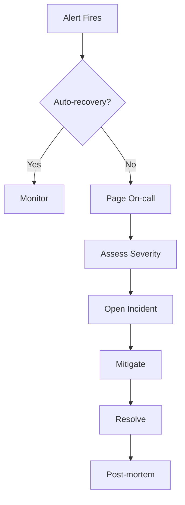

# Incident Response Runbook

> Standard operating procedure for production incidents.

## Severity Levels

| Level | Description | Response Time | Examples |
|-------|-------------|---------------|----------|
| **SEV1** | Complete outage | 5 min | All services down |
| **SEV2** | Major degradation | 15 min | >10% error rate |
| **SEV3** | Minor issue | 1 hour | Single pod crash |
| **SEV4** | No impact | Next business day | Alert tuning |

---

## Incident Flow



---

## Step-by-Step Response

### 1. Acknowledge (2 min)

```bash
# Acknowledge in PagerDuty/Slack
/incident ack

# Check alert details
kubectl get events -n inflow-prod --sort-by='.lastTimestamp'
```

### 2. Assess Severity

| Check | Command |
|-------|---------|
| Service health | `kubectl get pods -n inflow-prod` |
| Error rate | Check Grafana dashboard |
| User impact | Check API gateway logs |

### 3. Mitigate

**Quick mitigations:**

| Issue | Action |
|-------|--------|
| Pod crash loop | `kubectl rollout undo deployment/<name>` |
| High latency | Scale up: `kubectl scale deployment/<name> --replicas=5` |
| LLM failure | Disable LLM: See [llm-disable.md](./llm-disable.md) |
| Traffic surge | See [traffic-surge.md](./traffic-surge.md) |

### 4. Communicate

```
/incident update
Status: Investigating
Impact: [describe user impact]
ETA: [estimated resolution time]
```

### 5. Resolve

- Verify fix in monitoring
- Wait 15 min for stability
- Mark incident resolved

### 6. Post-mortem (within 48h)

Template:
1. Timeline of events
2. Root cause
3. Impact assessment
4. Action items
5. Lessons learned

---

## Emergency Contacts

| Role | Contact |
|------|---------|
| Platform On-call | See PagerDuty |
| ML On-call | See PagerDuty |
| Services On-call | See PagerDuty |

---

## Escalation

| After | Escalate to |
|-------|-------------|
| 15 min no progress | Add second on-call |
| 30 min no progress | Page lead |
| 1 hour no progress | Page VP |
