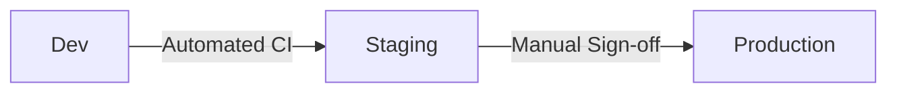

# Release Process

> How to promote releases from dev → staging → production.

## Overview



## Pre-Release Checklist

Before starting a release:

- [ ] All tests passing in CI
- [ ] No critical security vulnerabilities
- [ ] Feature flags configured
- [ ] Rollback plan documented
- [ ] Release notes prepared

---

## Release Flow

### 1. Create Release Branch

```bash
git checkout develop
git pull origin develop
git checkout -b release/v1.x.x
```

### 2. Version Bump

Update version numbers in:
- `services/*/VERSION` (or equivalent)
- `ml/models/baseline/config.yaml`
- `CHANGELOG.md`

### 3. Release Candidate to Staging

```bash
# Tag release candidate
git tag -a v1.x.x-rc1 -m "Release candidate 1"
git push origin v1.x.x-rc1

# Trigger staging deployment
gh workflow run promote.yaml -f version=v1.x.x-rc1 -f target=staging
```

### 4. Staging Validation

Wait for:
- [ ] All health checks passing
- [ ] Integration tests passing
- [ ] Performance benchmarks acceptable
- [ ] ML model metrics within thresholds

### 5. Sign-off

Required approvals:
- [ ] Platform Owner (Mohit)
- [ ] ML Owner (Richa)
- [ ] Services Owner (Satyajit)

### 6. Production Deployment (P3+)

```bash
# Tag final release
git tag -a v1.x.x -m "Release v1.x.x"
git push origin v1.x.x

# Trigger production deployment
gh workflow run promote.yaml -f version=v1.x.x -f target=production
```

---

## Model Promotion

### Pin Model Version

```bash
# Get current staging model version
mlflow models list --name inflow-baseline

# Pin for production
mlflow models update --name inflow-baseline --version 5 --stage Production
```

### Verify Model

```bash
# Check model is serving
curl https://inference.staging.inflow.ai/v1/predict \
  -H "Content-Type: application/json" \
  -d '{"request_id": "test", "features": {...}}'
```

---

## Release Artifacts

Each release must include:

| Artifact | Location |
|----------|----------|
| Release notes | `CHANGELOG.md` |
| Git tag | `v1.x.x` |
| Docker images | `registry/inflow-*:v1.x.x` |
| Model version | MLflow registry |
| Infra version | Kustomize overlays |

---

## Emergency Rollback

See [rollback.md](./rollback.md) for emergency procedures.
